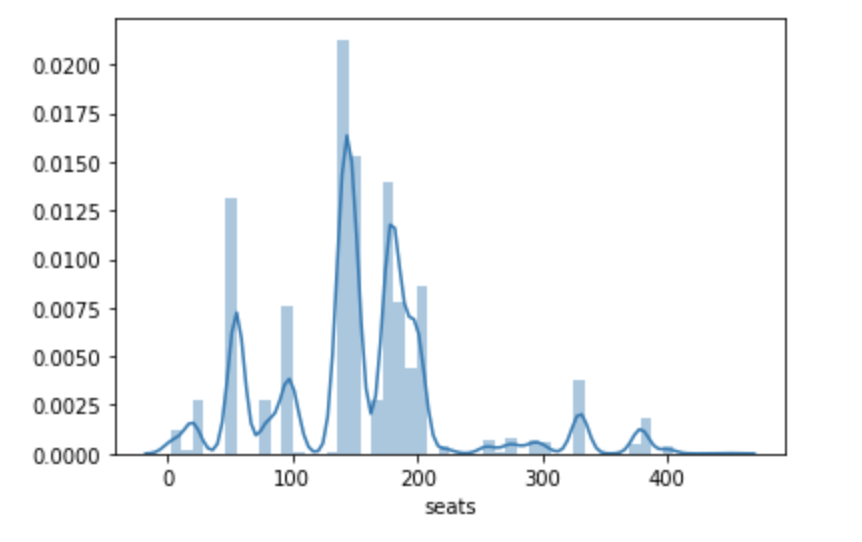
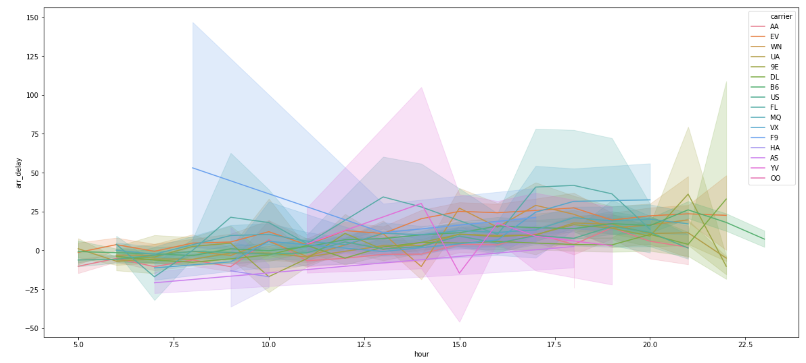
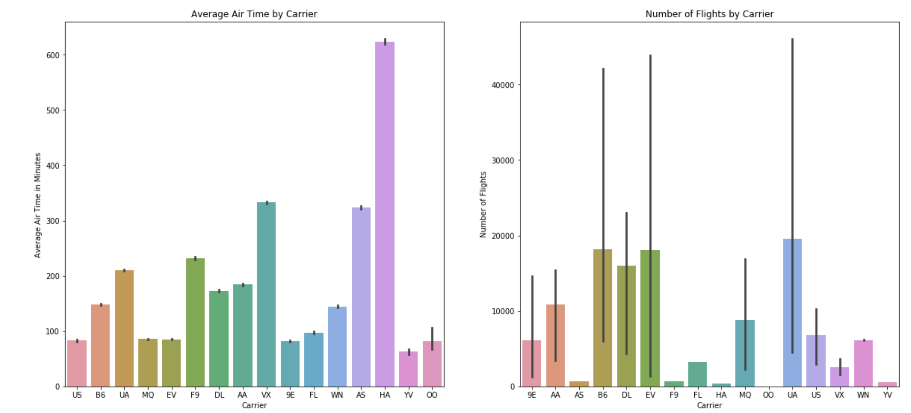

# Visulization – Lab
*Python for Data Science*

1. Recreate the below distribution graphic using the planes data.

2. Recreate the below graphic using the flights data. *Hint: what type of plot is this? You may need to google for it*

3. Recreate the below graphic using the flights data. You will need to manipulate your data in some ways first.

4. What do you think is the best way to visualize the times at which flights depart? Try creating a visual that you think is most informative about this.

5. Join together the planes and flights DataFrames. What new charts are now possible that were not before? Try making one.